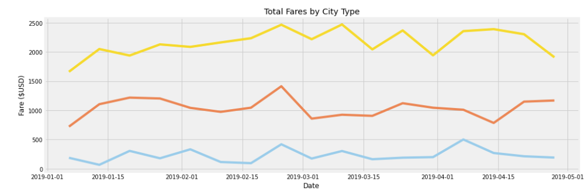

# PyBer_Analysis

## Project Overview
Create a summary DataFrame with PyBer's ride sharing data. 
This project is to show case weekly fares for each city type 
so that decision-makers at PyBer can make better informed decisions.  

In this project's scenario, we are tasked by the CEO of PyBer to create a 
summary DataFrame of the ride-sharing data by city type. I utilized Pandas
data frames to accomplish this task. 

### Resources
- Data Source: PyBer_ride_data.csv, city_data.csv, ride_data.csv
- Software: Python 3.10, JuPyter Notebook
- Librarys: MatPlotLib, Pandas, Numpy

## Project Results

### Rural
The average ride fare for the rural city type was the most expensive at $34.64 a ride. 
In comparison to urban (at $24.50) and suburban rides (at $30.74).
There are several factors related to difference in price, most notably lack of avaiable drivers.
In comparison to the number of drivers, there are a total of 78 PyBer drivers in the rural area. 

### Urban
The average ride fare for the urban city type is the least expensive at $24.50 a ride.
In comparison to rural (at $34.64) and suburban rides (at $30.74).
There are several factors related to difference in price, most notably the abundance of avaiable drivers.
In comparison to the number of drivers, there are a total of 2,405 PyBer drivers in the urban area. 

### Suburban
The average ride fare for the suburban city type is not the least expensive, nor is it the most expensive at $30.74 a ride.
In comparison to rural (at $34.64) and urban rides (at $24.50).
There are several factors related to difference in price, most notably the abundance of avaiable drivers.
In comparison to the number of drivers, there are a total of 490 PyBer drivers in the suburban area. 

## Summary
These comparisons can be seen in the image below.

There is a lack of drivers in the rural areas. There is a clear demand for rides, with customers willing to pay $34.64 a ride.
If PyBer could focus on getting more drivers to the rural areas, prices for rides would go down, but overall fare totals will go up. 
